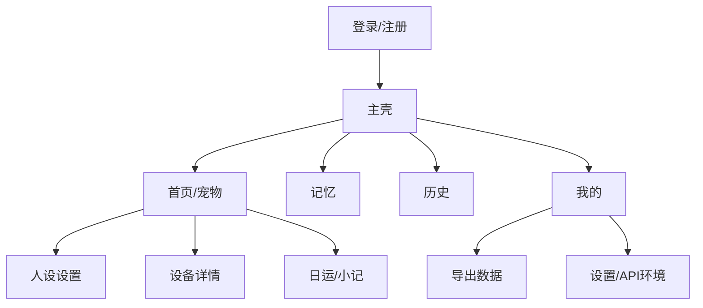

# 03 — 信息架构与页面规格

## 全局 IA（手机：底部 Tab；桌面：侧栏）

## 页面规格

### P0 登录 / 注册
- 手机号或邮箱（随后端）+ 密码  
- 内测可显示「高级：API 地址」折叠项  

### P1 首页（宠物）
- 当前设备卡片：名称、在线、最后活跃  
- 人设摘要：座 + MBTI + kb_version  
- 入口：设置人设、看日运、外设状态  
- 空态：引导「添加设备」  

### P2 添加/绑定设备
- 输入 device_uid 或从列表选择（若配网后已上报）  
- 配网引导步进（可图文）  
- 成功 → 回首页并进入人设  

### P3 人设设置
- 星座网格 / 列表  
- MBTI 十六型或四维简问  
- 忌口多行文本  
- 开关：跟随知识库更新  
- 保存成功 Toast  

### P4 记忆
- 列表 + 搜索  
- 新建记忆  
- candidate 角标：通过 / 忽略  
- 滑动删除（手机）/ 右键删除（桌面）  

### P5 历史
- 按日分组气泡或列表  
- 筛选设备（多设备时）  
- 删除某日：二次确认  

### P6 日运 / 小记
- 今日短上下文卡片  
- 历史小记列表（来自 analyses）  
- 无数据空态：「聊几天后会出现」  

### P7 外设状态
- 使用当前选中的已认领设备请求 `GET /devices/{id}/peripheral`，只读展示最近一份外设快照。
- 展示眼睛表情（emotion）、视线（gaze）、闭眼状态、更新时间；`extra` 仅在有可读键值时补充展示。
- 接口返回 404 表示设备尚未上报快照，展示“等待设备上报状态”的空状态，而不是报错。
- 无当前设备时引导用户前往首页选择设备或先绑定设备；网络与其他接口错误可手动刷新重试。
- 文案说明：表情与动作由宠物本体执行，本页不提供控制能力。

### P8 我的
- 账号信息、退出  
- 导出我的数据  
- 关于 / 隐私  
- （桌面）窗口行为：关闭到托盘（可选）  

## 关键交互文案

| 场景 | 文案要点 |
|------|----------|
| 保存人设 | 下次和宠物说话时生效 |
| 删除历史 | 删除后不可恢复 |
| 离线设备 | 仍可改人设与记忆；需设备上线后会话才带新人设 |
