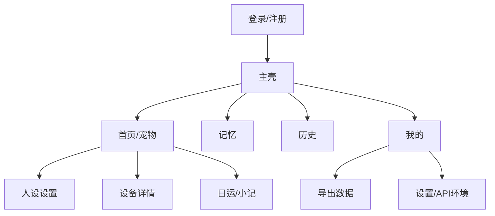

# 03 — 信息架构与页面规格

## 全局 IA（手机：底部 Tab；桌面：侧栏）

## 页面规格

### P0 登录 / 注册
- 手机号或邮箱（随后端）+ 密码  
- 内测可显示「高级：API 地址」折叠项  

### P1 首页（宠物）
- 当前设备卡片：名称、在线、最后活跃  
- 人设摘要：在当前设备卡片下读取 `GET /devices/{id}/persona`，展示星座、MBTI、知识库版本及跟随策略；未配置（404）时展示“还没有设置人设”与设置入口，不伪造默认人设。
- 设备列表：点选切换当前设备；每行支持行内改名（`PATCH /devices/{id}`）与解绑（`DELETE /devices/{id}`，二次确认，提示历史数据保留、设备可重绑）；解绑后列表为空走空态。
- 入口：设置人设、看日运、外设状态  
- 空态：引导「添加设备」  

### P2 添加/绑定设备
- 输入绑定码 `binding_id` 认领（扫码为取景框占位，PWA 阶段手动输入）；不再支持 MAC/device_uid 直绑  
- 配网引导步进（可图文，待固件素材）  
- 成功 → 回首页并进入人设  

### P3 人设设置
- 星座：12 宫格手工直选  
- MBTI：四维（E/I、S/N、T/F、J/P）行选手工直选；不调 questionnaire 端点（后端当前 501）  
- 忌口多行文本（每行一条）  
- 开关：钉扎人设（开启后不跟随知识库更新）  
- 保存成功后页内提示「已保存，下次和宠物说话时生效」（非 Toast）；422 表示人设组合暂不可用  
- 成长建议卡：读取当前设备最近一条 `persona_growth` analyses（`GET /devices/{id}/analyses?kind=persona_growth&limit=1`），展示建议摘要、依据与建议 overrides；无数据时空态「等待生成」（参考 P6 小记空态模式）
- 「应用建议」二次确认（window.confirm）后调 `POST /devices/{id}/analyses/{aid}/apply-persona-growth`，把建议合并进设备私有 overrides；成功后刷新建议卡与人设数据并提示「已应用」；404 表示建议已失效，409 表示无可应用内容或未配置人设
- 主人八字卡（E10，独立保存）：读写 `GET/PUT /devices/{id}/bazi`，字段为阳历/阴历、出生日期、出生时辰（可勾选「时辰未知」）、出生地、性别（均可空项除外日期与历法必填）；未录入时 GET 404 视为空表单；保存成功后页内提示去日运页查看八字运势；422 表示出生信息格式有误

### P4 记忆
- 基于当前设备显示列表并支持关键词搜索、分页加载。
- 支持手动新建、归档删除；`candidate` 记忆提供通过/忽略操作。
- 无结果时引导用户与宠物互动或手动记录；不展示伪造的候选数据。

### P5 历史
- 按日分组气泡或列表  
- 筛选设备（多设备时）  
- 删除某日：二次确认  

### P6 日运 / 小记
- 运势卡（E10，页首）：读取 `GET /devices/{id}/fortune/daily`（`date` 缺省当天），展示当日星座五维度（综合/事业/财运/学业/感情）、`greeting` 与已生成时的八字运势；`generating=true` 或内容字段为 null 时显示「生成中」空态，手动刷新重查；404 表示设备未配置星座人设，引导先去人设页设置。
- 读取当前设备的 `daily_summary` analyses，展示最近一条摘要、主题、心情和跟进建议，并保留历史小记列表。
- 无数据空态：「等待会话结束后的服务端小结」，不在 App 内计算日运或星盘。

### P7 外设状态
- 使用当前选中的已认领设备请求 `GET /devices/{id}/peripheral`，只读展示最近一份外设快照。
- 展示眼睛表情（emotion）、视线（gaze）、闭眼状态、更新时间；`extra` 仅在有可读键值时补充展示。
- 接口返回 404 表示设备尚未上报快照，展示“等待设备上报状态”的空状态，而不是报错。
- 无当前设备时引导用户前往首页选择设备或先绑定设备；网络与其他接口错误可手动刷新重试。
- 文案说明：表情与动作由宠物本体执行，本页不提供控制能力。

### P8 我的
- 账号信息、退出  
- 导出我的数据  
- 关于 / 隐私  
- （桌面）窗口行为：关闭到托盘（可选）  

## 关键交互文案

| 场景 | 文案要点 |
|------|----------|
| 保存人设 | 下次和宠物说话时生效 |
| 删除历史 | 删除后不可恢复 |
| 离线设备 | 仍可改人设与记忆；需设备上线后会话才带新人设 |
