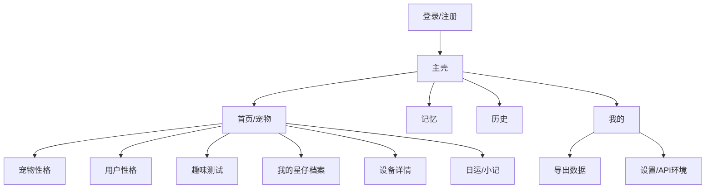

# 03 — 信息架构与页面规格

## 全局 IA（手机：底部 Tab；桌面：侧栏）

## 页面规格

### P0 登录 / 注册
- 手机号或邮箱（随后端）+ 密码  
- 内测可显示「高级：API 地址」折叠项  

### P1 首页（宠物）
- 当前设备卡片：名称、在线、最后活跃  
- 人设摘要：在当前设备卡片下读取 `GET /devices/{id}/persona`，展示星座、MBTI、知识库版本及跟随策略；已有 dossier 时附身份/关系一句；未配置（404）时展示“还没有设置宠物性格”与设置入口，不伪造默认人设。
- 设备列表：点选切换当前设备；每行支持行内改名（`PATCH /devices/{id}`）与解绑（`DELETE /devices/{id}`，二次确认，提示历史数据保留、设备可重绑）；解绑后列表为空走空态。
- 入口：宠物性格、用户性格、趣味测试、我的星仔档案、看日运、外设状态  
- 空态：引导「添加设备」  

### P2 添加/绑定设备
- 输入绑定码 `binding_id` 认领（扫码为取景框占位，PWA 阶段手动输入）；不再支持 MAC/device_uid 直绑  
- 配网引导步进（可图文，待固件素材）  
- 成功 → 回首页并进入人设  

### P3 宠物性格（原「人设设置」）
- 页题固定为「宠物性格」，入口文案用「设置宠物性格」。禁止再写「人设设置」「主人人设」，以免和用户性格页搞混。
- 页顶粘性快捷跳转：页内锚点（星座 / 性格 / 忌口 / 成长建议）+ 跳转新页（用户性格测试 `/owner`、趣味测试 `/tests`、星仔档案 `/star`）。点击页内项平滑滚到对应卡片，卡片需留出粘性栏高度。
- 本页只编辑**这只宠物**：星座 12 宫格直选；MBTI 四维行选直选；忌口多行文本；钉扎性格（开启后不跟随知识库更新）。
- **不**在本页内嵌 20 题问卷或主人生辰。问卷写入主人档案，见 P3.2；趣味测验见 `/tests`。
- 保存必须带上当前 `overrides` 其余键与 `dossier`，只更新忌口，避免冲掉成长建议和角色档案。
- 保存成功后页内提示「已保存，下次和宠物说话时生效」（非 Toast）；422 表示人设组合暂不可用。
- 成长建议卡：读取当前设备最近一条 `persona_growth` analyses（`GET /devices/{id}/analyses?kind=persona_growth&limit=1`），展示建议摘要、依据与建议 overrides；无数据时空态「等待生成」（参考 P6 小记空态模式）。
- 「应用建议」二次确认（window.confirm）后调 `POST /devices/{id}/analyses/{aid}/apply-persona-growth`，把建议合并进设备私有 overrides；成功后刷新建议卡与宠物性格并提示「已应用」；404 表示建议已失效，409 表示无可应用内容或未配置宠物性格。

### P3.2 用户性格（`/owner`）
- 页题「用户性格」。说明：这是主人自己的性格，账号一份、多设备共享；和星仔的宠物性格是两回事。
- 页顶同样提供粘性跳转：我的星座 / 用户性格测试 / 主人生辰 / 趣味测试 / 返回宠物性格。
- 主人星座、MBTI 直选走 `GET/PUT /owner`；未建档 GET 404 为空表单。日运 L1 取主人太阳星座，未录入不回退宠物星座。
- **用户性格测试**：20 题测的是主人，不是宠物。`GET/POST /owner/questionnaire`（设备路径问卷仅为别名）。客户端只展示 a/b、不算型；提交响应是主人档案，禁止回写宠物 `persona`。默认收起，从宠物性格页点「用户性格测试」时打开并滚到题目。
- 主人生辰（原「主人八字」卡，从宠物性格页迁出）：读写 `GET/PUT /devices/{id}/bazi`，字段为阳历/阴历、出生日期、出生时辰（可勾选「时辰未知」）、出生地、性别；未录入 GET 404 视为空表单；无当前设备时提示先绑定。保存成功后提示去日运页查看八字运势；422 表示出生信息格式有误。
- 趣味测试/星盘仍在独立页 `/tests`：趣味测验列表、作答；「看结果」进入 `/tests/result`。海报本地 canvas 绘制。简略星盘（太阳/月亮/五星/上升）。默认只在 App 看。

### P3.1 我的星仔（角色档案）
- 读 `GET /devices/{id}/persona` 的 `dossier`：身份、背景、角色、目标、进化规则、关系 **全部可见可编辑**（用户 2026-08-18 拍板，不再等字段边界）。
- 身份、关系为长文本；背景/角色/目标/进化规则每行一条、各最多 8 条。
- 保存走同一 `PUT /persona`，必须回传现有星座、MBTI、overrides、钉扎，只改 dossier；未配置宠物性格（404）引导先去 P3 选星座和 MBTI。
- 保存成功后页内提示「已保存，下次和宠物说话时生效」。

### P4 记忆
- 页首记忆画像卡：`GET /devices/{id}/analyses?kind=memory_profile&limit=1`，展示 `remembered`（标题/摘要/标签）、`companion_impact`、`memory_count`；无记录走「等待生成」空态；`memory_count=0` 视为空画像而非报错。不展示 candidate、不展示原文级敏感字段。
- 基于当前设备显示列表并支持关键词搜索、分页加载。
- 支持手动新建、归档删除；`candidate` 记忆提供通过/忽略操作。
- 无结果时引导用户与宠物互动或手动记录；不展示伪造的候选数据。

### P5 历史
- 按日分组气泡或列表  
- 筛选设备（多设备时）  
- 删除某日：二次确认  

### P6 日运 / 小记
- 运势卡（E10，页首）：读取 `GET /devices/{id}/fortune/daily`（`date` 缺省当天），展示当日星座五维度（综合/事业/财运/学业/感情）、`greeting` 与已生成时的八字运势；`generating=true` 或内容字段为 null 时显示「生成中」空态，手动刷新重查；404 表示主人尚未配置太阳星座，引导先去「用户性格」页设置（日运 L1 不回退宠物星座）。
- 读取当前设备的 `daily_summary` analyses，展示最近一条摘要、主题、心情和跟进建议，并保留历史小记列表。
- 无数据空态：「等待会话结束后的服务端小结」，不在 App 内计算日运或星盘。

### P7 外设状态
- 使用当前选中的已认领设备请求 `GET /devices/{id}/peripheral`，只读展示最近一份外设快照。
- 展示眼睛表情（emotion）、视线（gaze）、闭眼状态、更新时间；`extra` 仅在有可读键值时补充展示。
- 接口返回 404 表示设备尚未上报快照，展示“等待设备上报状态”的空状态，而不是报错。
- 无当前设备时引导用户前往首页选择设备或先绑定设备；网络与其他接口错误可手动刷新重试。
- 文案说明：表情与动作由宠物本体执行，本页不提供控制能力。

### P8 我的
- 账号信息、退出
- 今天的小记摘要卡：读取当前设备最新一条 `daily_summary`，展示摘要与生成状态，点击进入完整「日运 / 小记」页。
- 问卷与测试：提供主人性格问卷入口，并读取服务端 `GET /tests` 展示当前可用的趣味测试入口。
- 导出我的数据：对当前设备 `POST /devices/{id}/export`，同步消费 JSON 包（摘要 + 本地下载），不含 `device_uid` 与八字生辰原文；二次确认后导出
- 关于 / 隐私  
- （桌面）窗口行为：关闭到托盘（可选）  

## 关键交互文案

| 场景 | 文案要点 |
|------|----------|
| 保存宠物性格 | 下次和宠物说话时生效 |
| 删除历史 | 删除后不可恢复 |
| 离线设备 | 仍可改人设与记忆；需设备上线后会话才带新人设 |
