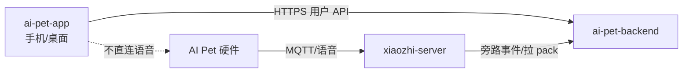

# 05 — 对接 API 与数据流

契约以 `ai-pet-backend/docs/06-HTTP-API规范.md` 为准（仅用**用户侧**路径，不用 `/admin/*`、少用 `/internal/*`）。

## 数据流



## 页面 → API

| 页面 | API |
|------|-----|
| 登录注册 | `POST /auth/login` `POST /auth/register` |
| 设备 | `GET /devices` `POST /devices/bind` `GET /devices/{id}` |
| 人设 | `GET/PUT /devices/{id}/persona` |
| 角色档案 | `GET/PUT /devices/{id}/persona` 的 `dossier` |
| 人设问卷 | `GET/POST /devices/{id}/persona/questionnaire`（不算型） |
| 历史 | `GET/DELETE /devices/{id}/messages` |
| 记忆 | `CRUD /devices/{id}/memories` + `approve` |
| 分析/小记/画像 | `GET /devices/{id}/analyses?kind=`（`daily_summary` / `persona_growth` / `memory_profile`） |
| 外设 | `GET /devices/{id}/peripheral` |
| 导出 | `POST /devices/{id}/export`（同步 JSON 包） |

### 当前设备选择（B2.2）

- 登录后首页调用 `GET /devices` 获取当前用户已认领的设备；只显示后端返回的数据，不查询 admin 资产接口。
- 用户可在首页切换当前设备，当前设备 ID 持久化在本机，用于人设页和后续历史、记忆等用户端页面。
- 设备详情摘要展示名称、在线状态、最近活跃和固件版本；没有设备时引导至绑定页。

### 首页人设摘要（C4）

- 首页在设备列表加载成功后，对当前选中设备请求 `GET /devices/{id}/persona`；切换当前设备时重新请求，避免将 A 设备的人设展示给 B 设备。
- 响应展示 `sun_sign`、`mbti`、`kb_version` 与 `follow_latest`。404 表示尚未配置人设，展示空状态和“设置人设”入口；其他请求失败不覆盖设备列表数据。

## 配网与绑定（说明）

1. 用户按引导让设备上网（固件现有小智配网流程）。  
2. 设备连上 `xiaozhi-server` 后以 MAC/SN 作为内部 `device_uid` 上报 `devices/seen`。  
3. backend 首见设备生成不可猜测的 `binding_id`；App 扫码或手动输入该绑定标识，并调用 `POST /devices/bind` 认领。App 不得传 MAC 或后端自增 ID 认领设备。  
4. 人设写入 backend → 下次会话 xiaozhi 拉 `persona_pack`。  

### 手动绑定交互（E1.1 正式契约）

- 提交前去除输入首尾空白；请求体为 `{ "binding_id": "<扫码或设备标签提供的绑定码>" }`，携带当前登录用户的 Bearer Token。
- 成功（201）显示已绑定的设备标识，并提供返回首页的入口；404 提示绑定码不存在或已失效；409 提示已被其他用户认领；403 表示错误地使用了 admin 账号。
- 当前 app 的 MAC 直绑实现仅为 E1 过渡代码；backend E1.1 部署后必须同步迁移，不能将 MAC 视为用户绑定凭据。

### 人设交互（E2）

- 人设页必须带当前用户已认领设备的 `device_id`；绑定成功后由响应中的 `id` 跳转携带。未选择设备时不允许读写人设。
- `GET /devices/{id}/persona` 返回 404 表示尚未配置，页面保持空表单；其他错误显示加载失败。
- 保存请求为 `{ sun_sign, mbti, overrides, follow_latest, dossier }`。PUT 是整对象覆盖：忌口只更新 `overrides.taboo`，必须合并已有 overrides（成长建议）并回传现有 `dossier`。界面的“钉扎人设”与 `follow_latest` 语义相反：钉扎时传 `false`。
- 后端已发布完整的 12 星座与 16 MBTI 种子；若后续返回 422，页面提示保存失败并保留用户当前选择。

### 角色档案（A1 / dossier）

- 六字段全部对用户可见可编辑：`identity`、`background[]`、`roles[]`、`goals[]`、`evolution_rules[]`、`relationship`。
- 独立页读写同一 `GET/PUT /persona`；保存时回传现有星座/MBTI/overrides/钉扎，只改 dossier。
- 尚未配置人设时不可单独写档案，引导先去人设页。

### 人设问卷（E2.1 / A10）

- `GET /devices/{id}/persona/questionnaire` 返回 `answers_required` 与 20 道题（`id/dimension/prompt/a/b`），不含计分键。
- `POST` body：`{ answers: ("a"|"b")[20], sun_sign? }`；可附带现有 `overrides`/`dossier`/`follow_latest`，避免冲掉档案与成长建议。
- 未配置人设时 `sun_sign` 必填，否则 422。响应为人设对象，用返回的 `mbti` 回填直选，不在客户端计分。
- 问卷不得替代星座/MBTI 直选。`POST /persona/preview` 本轮不做（返回内部 persona_pack 片段，不直接给用户看）。

### 历史交互（E4）

- 历史页使用当前选中设备的 `device_id` 请求 `GET /devices/{id}/messages?limit&offset`，仅展示 backend 已脱敏的 `content_redacted`，按本地日期分组。
- 首次加载 20 条，可继续加载下一页；无当前设备时引导用户先绑定或在首页选择设备。
- 删除以一天为最小确认单位，调用 `DELETE /devices/{id}/messages?from=<ISO>&to=<ISO>`；后端要求至少提供一个时间边界并写审计，前端不得发无条件删除请求。

### 记忆交互（C2）

- 记忆页按当前选中设备调用 `GET /devices/{id}/memories?q&status&limit&offset`；支持关键词和状态筛选，列表为空时显示可恢复空态。
- 手动新建调用 `POST /devices/{id}/memories`，请求包含可选 `title`、必填 `content` 及最多 20 个 `tags`；新建的记录为 `manual/active`。
- `candidate` 状态仅可调用 `POST /memories/{mid}/approve` 或 `/reject` 审核；用户删除调用 `DELETE /memories/{mid}`，后端归档并保留审计。

### 日运/小记交互（D2）

- 日运/小记页调用 `GET /devices/{id}/analyses?kind=daily_summary&limit&offset`，只读展示后端 worker 写入的结果。
- `daily_summary.payload` 的常用字段为 `summary`、`topics`、`user_mood`、`follow_up`；页面兼容字段缺失和 `{ empty: true }`，显示等待下一次服务端小结的空态。
- 记忆画像：`GET /devices/{id}/analyses?kind=memory_profile&limit=1`，payload 为 `remembered` / `companion_impact` / `memory_count` / `updated_from`；无记录为空态，不在客户端拼画像。

### 导出交互（E8 / A8）

- `POST /devices/{id}/export` 同步返回 JSON 包并落 `data_export` 快照；无文件 URL、不轮询任务。
- 包内含 `exported_at`、设备（`device_uid_redacted`）、人设摘要、`bazi_recorded`（只回是否已录入）、记忆最多 100、脱敏消息最多 200、分析最多 100（不含 `data_export` 自身）、近 30 天 `daily_contents`。
- 页面展示条数摘要，并提供本地下载 JSON；二次确认后导出。

### 外设状态交互（D1）

- 外设状态页使用当前选中设备的 `device_id` 调用 `GET /devices/{id}/peripheral`，仅消费用户 API，不直连设备或内部 MCP。
- 响应字段为 `eye_emotion`、`eye_gaze`、`eye_closed`、`extra`、`updated_at`；页面将眼睛状态转换为中文可读文案，并显示快照更新时间。
- 404 的语义是该设备尚没有外设快照，显示等待设备上报的空状态；无选中设备时引导至首页选择或绑定设备。其他请求失败显示错误与刷新入口。

App **不实现** OTA；OTA 属固件/小智服务。

## 环境配置

```text
VITE_API_BASE=/api
```

生产部署采用同源反代：用户端由 Nginx 的 `:8081` 提供静态文件，并将 `/api/`
代理至 backend `127.0.0.1:8010`。因此构建产物必须使用相对地址 `/api`，避免浏览器
跨端口访问管理台的 `:8080`。本地直连后端时可在 `.env.local` 覆盖
`VITE_API_BASE=http://<host>:<port>/api`。

认证契约：`POST /auth/register` 返回用户信息（201），不签发 Token；随后必须调用
`POST /auth/login`，读取 `access_token` 并以 `Authorization: Bearer <token>` 调用
`GET /auth/me`。

## 错误与空态

| 情况 | 处理 |
|------|------|
| 401 | 清 Token，回登录 |
| 设备离线 | 允许编辑人设/记忆，状态条提示离线 |
| 列表空 | 引导去绑定或先去和宠物聊天 |
