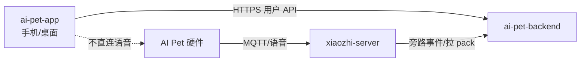

# 05 — 对接 API 与数据流

契约以 `ai-pet-backend/docs/06-HTTP-API规范.md` 为准（仅用**用户侧**路径，不用 `/admin/*`、少用 `/internal/*`）。

## 数据流



## 页面 → API

| 页面 | API |
|------|-----|
| 登录注册 | `POST /auth/login` `POST /auth/register` |
| 设备 | `GET /devices` `POST /devices/bind` `GET /devices/{id}` |
| 人设 | `GET/PUT /devices/{id}/persona` |
| 历史 | `GET/DELETE /devices/{id}/messages` |
| 记忆 | `CRUD /devices/{id}/memories` + `approve` |
| 分析/小记 | `GET /devices/{id}/analyses?kind=` |
| 外设 | `GET /devices/{id}/peripheral` |
| 导出 | `POST /devices/{id}/export` |

## 配网与绑定（说明）

1. 用户按引导让设备上网（固件现有小智配网流程）。  
2. 设备连上 `xiaozhi-server` 后具备 `device_uid`。  
3. App 调用 `POST /devices/bind` 把设备挂到当前用户。  
4. 人设写入 backend → 下次会话 xiaozhi 拉 `persona_pack`。  

App **不实现** OTA；OTA 属固件/小智服务。

## 环境配置

```text
VITE_API_BASE=/api
```

生产部署采用同源反代：用户端由 Nginx 的 `:8081` 提供静态文件，并将 `/api/`
代理至 backend `127.0.0.1:8010`。因此构建产物必须使用相对地址 `/api`，避免浏览器
跨端口访问管理台的 `:8080`。本地直连后端时可在 `.env.local` 覆盖
`VITE_API_BASE=http://<host>:<port>/api`。

认证契约：`POST /auth/register` 返回用户信息（201），不签发 Token；随后必须调用
`POST /auth/login`，读取 `access_token` 并以 `Authorization: Bearer <token>` 调用
`GET /auth/me`。

## 错误与空态

| 情况 | 处理 |
|------|------|
| 401 | 清 Token，回登录 |
| 设备离线 | 允许编辑人设/记忆，状态条提示离线 |
| 列表空 | 引导去绑定或先去和宠物聊天 |
